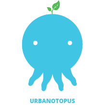

  

<h1>Urbanotopus Game and Docs</h1>
  
Game sources and documentation for Urbanotopus.

  
Note: this project requires Unity 2018.2.14f1 
for <a href='https://netstorage.unity3d.com/unity/3262fb3b0716/UnityDownloadAssistant-2018.2.14f1.exe'>Windows</a> 
| <a href='https://netstorage.unity3d.com/unity/3262fb3b0716/UnityDownloadAssistant-2018.2.14f1.dmg'>MacOS</a>
| <a href='https://unity.com/'>Others</a>.

## Download links
**You will find the latest download link [here](https://github.com/Urbanotopus/urbanotopus/releases) (for Windows, Linux, Mac, Android and iOS).**
And a browser demo (WebGL) <a href='https://urbanotopus.github.io/urbanotopus/'>here</a>.

## Other links
- Our [specs sheets](https://docs.google.com/document/d/1UJg4NzmXjWdLV1RQkpC4ds9JVwjxbo_du1KpwaHBMdI/edit?usp=sharing);
- Our [task dashboard](https://docs.google.com/spreadsheets/d/1ssWvanr6t2i7n3NQZzfvbAibnp2f_unJ5_dDhjydA1w/edit?usp=sharing).

## Documentation
<!-- Begin TOC -->

<ul>
<li class="toctree-l1"><a class="reference internal" href="https://urbanotopus.readthedocs.io/en/latest/introduction.html">Le jeu</a><ul>
<li class="toctree-l2"><a class="reference internal" href="https://urbanotopus.readthedocs.io/en/latest/introduction.html#le-fonctionnement">Le fonctionnement</a></li>
<li class="toctree-l2"><a class="reference internal" href="https://urbanotopus.readthedocs.io/en/latest/introduction.html#le-deroulement-dune-partie">Le déroulement d’une partie</a></li>
</ul>
</li>
<li class="toctree-l1"><a class="reference internal" href="https://urbanotopus.readthedocs.io/en/latest/conventions.html">Conventions du projet</a><ul>
<li class="toctree-l2"><a class="reference internal" href="https://urbanotopus.readthedocs.io/en/latest/conventions/task-distribution.html">La répartition des tâches</a></li>
</ul>
</li>
<li class="toctree-l1"><a class="reference internal" href="https://urbanotopus.readthedocs.io/en/latest/contributing.html">Guides de contribution</a><ul>
<li class="toctree-l2"><a class="reference internal" href="https://urbanotopus.readthedocs.io/en/latest/contributing/editorconfig.html">EditorConfig</a></li>
<li class="toctree-l2"><a class="reference internal" href="https://urbanotopus.readthedocs.io/en/latest/contributing/coding-style.html">Style de codage</a></li>
<li class="toctree-l2"><a class="reference internal" href="https://urbanotopus.readthedocs.io/en/latest/contributing/naming.html">Convention de nommage</a></li>
<li class="toctree-l2"><a class="reference internal" href="https://urbanotopus.readthedocs.io/en/latest/contributing/contribute-source-code.html">Contribuer au code</a></li>
<li class="toctree-l2"><a class="reference internal" href="https://urbanotopus.readthedocs.io/en/latest/contributing/documenting-source-code.html">Documenter le code source</a></li>
<li class="toctree-l2"><a class="reference internal" href="https://urbanotopus.readthedocs.io/en/latest/contributing/documenting-project.html">Documenter le projet et fonctionnalités</a></li>
</ul>
</li>
<li class="toctree-l1"><a class="reference internal" href="https://urbanotopus.readthedocs.io/en/latest/development_guides.html">Guides de développement</a><ul>
<li class="toctree-l2"><a class="reference internal" href="https://urbanotopus.readthedocs.io/en/latest/development_guides/visual-novel-scenes.html">Scènes de Visual Novel</a></li>
<li class="toctree-l2"><a class="reference internal" href="https://urbanotopus.readthedocs.io/en/latest/development_guides/choice-management.html">Gestion des décisions</a></li>
<li class="toctree-l2"><a class="reference internal" href="https://urbanotopus.readthedocs.io/en/latest/development_guides/loading-scenes.html">Charger des scènes</a></li>
</ul>
</li>
<li class="toctree-l1"><a class="reference internal" href="https://urbanotopus.readthedocs.io/en/latest/resources.html">Ressources</a></li>
</ul>

<!-- End TOC -->

## How to build the docs
### Hand written documentation (sphinx)
#### Installation of the requirements
1. Install [Python 3.7](https://www.python.org/downloads/release/python-337/);
1. Create and activate a [python virtual environment](https://docs.python.org/3/library/venv.html);
1. Install the requirements through `pip install -r requirements.txt`;
1. (Optional) Edit the files under the [docs](docs/) folder;

#### Building the sphinx documentation
1. Build or rebuild the docs by running `make html` in the root project directory;
1. Open your web-browser to `build/html/index.html`.

### Source code documentation (doxygen)
#### Installation of the requirements
Install doxygen through this [link](http://www.stack.nl/~dimitri/doxygen/download.html)
or using your preferred Unix package manager.

#### Generating the doxygen documentation
1. Build or rebuild by running `doxygen` in the root project directory.
1. Open your web-browser to `html/index.html`.

## Resources
- [**How to document a project using Sphinx**](https://pythonhosted.org/an_example_pypi_project/sphinx.html#restructured-text-rest-resources);
- [**How to use the `venv` Python module to create and manage virtual environments**](https://docs.python.org/3/library/venv.html).
- [Appveyor CI documentation to build the project on Windows](https://www.appveyor.com/docs/);
- [Travis CI documentation to build the project on Linux and Mac OS](https://docs.travis-ci.com/).
