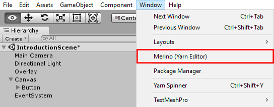

Scènes de Visual Novel
======================

Ajouter un script
-----------------

Dans le dossier `Assets/YarnScripts <https://github.com/Urbanotopus/urbanotopus/tree/master/Assets/YarnScripts>`_,
créez un nouveau script Yarn ayant pour extension de fichier ``.yarn.txt`` (**important**).

Modifier un script (Yarn)
-------------------------

    Capture d'écran du menu Unity

Les scripts sont écrits dans le langage `Yarn <https://github.com/thesecretlab/YarnSpinner>`_
(`documentation <https://github.com/thesecretlab/YarnSpinner/tree/master/Documentation>`_).

Afin d'éditer les nodes et scripts, utilisez l'éditeur **Merino** qui est inclut avec le projet dans le menu *Window* :
``Window > Merino (Yarn Editor)``.

Les dialogues
+++++++++++++
Un dialogue se compose ainsi :

.. code-block:: text

    Eve: Hey, I'm a character speaking in a dialogue!
    Bob: Wow! Me too!
    I'm a narrative guy I guess...

Les nœux (nodes)
++++++++++++++++

- Le node de base : **Start**

    .. code-block:: text

        Eve: Hi!
        [[ NodeInTheWoods ]]
        Eve: I'm back.

    Ce node instruit Eve a dire bonjour et à aller dans les bois,
    donc dans le node ``NodeInTheWoods``, **Eve ne reviendra jamais des bois**, car c'est un ``GOTO``.

- Le node dans les bois : **NodeInTheWoods**

    .. code-block:: text

        Eve: the woods are so scary...

Les choix de nœux
+++++++++++++++++

Si nous souhaitons laisser le choix à l'utilisateur entre aller dans le nœu de la maison hantée
ou dans le nœu de la plage on fera :

.. code-block:: text

    Eve: where should I go...
    [[ The haunted house | HauntedHouse ]]
    [[ The beach | Beach ]]

Les choix simples
+++++++++++++++++

Si vous souhaitez faire en sorte que l'utilisateur puisse choisir pour executer un dialogue
puis retourner à l'exécution normale, faites :

.. code-block:: text

    Mae: What did you say to her?
    -> Nothing.
        Mae: Oh, man. Maybe you should have.
    -> That she was an idiot.
        Mae: Hah! I bet that pissed her off.
    Mae: Anyway, I'd better get going.

Les choix conditionnels
+++++++++++++++++++++++

Si vous souhaitez afficher des actions seulement dans certains cas, vous avez la possibilité de faire cela :

.. code-block:: text

    << set $money = 2 >>
    Bob: What would you like?
    -> A burger. << if $money >= 5 >>
        Bob: Nice. Enjoy!
    -> A soda. << if $money >= 2 >>
        Bob: Yum!
    -> Nothing.
    Bob: Thanks for coming!

Les déclarations de variables et de conditions
++++++++++++++++++++++++++++++++++++++++++++++

Vous pouvez déclarer des variables avec des expressions et
des conditions avec les mots ``if``, ``elseif`` et ``else``.

.. code-block:: text

    << set $number_of_hostages = 12 >>
    << set $hostages_saved = 1 >>
    << set $hostages_saved = $number_of_hostages / 2 >>

    << if $hostages_saved == $number_of_hostages and $time_remaining > 0 >>
        You win the game!
    << elseif $hostages_saved < $number_of_hostages and $time_remaining > 0 >>
        You need to rescue more hostages!
    << elseif $bomb_has_exploded == 0 >>
        You failed to rescue the hostages before time ran out!
    << else >>
        You failed everything.
    << endif >>
