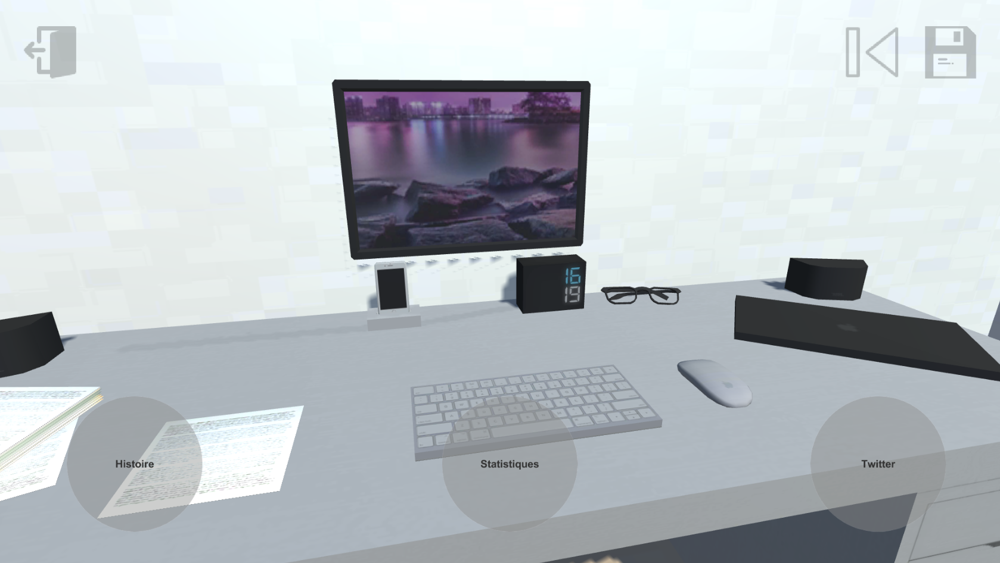

Le jeu
======

*Urbanotopus* est un jeu où le joueur se fond dans l'histoire d'un urbaniste
avec une multitude de choix menant à une infinité de dénouements de l'histoire.

L'objectif de ce jeu est d'apprendre au joueur les implications de chaque choix
et donc l'important qu'à et que les choix, parfois difficiles de l'urbaniste ont.

Le fonctionnement
-----------------
Chaque jour, le joueur est présenté à de nouvelles situations
ou des situations en continues où le joueur doit prendre une
ou des actions qui modifient les variables de sa partie.
Ces situations et décisions peuvent influencer en bien
ou en mal la partie du joueur en fonction de ses décisions.

Le joueur peut très facilement juger de ses performances
à partir des conséquences, mais aussi en lisant ce que les gens postent
sur le flux Twitter. Mais encore en regardant les statistiques de la partie.

Le déroulement d’une partie
---------------------------
Après avoir été introduit au jeu, le joueur retourne dans *son* bureau d'urbaniste, où,
il est présenté à de nouvelles tâches et décisions dans l'onglet ``Histoire``,
parmi lesquels il doit choisir sa prochaine destination.

L'interface
+++++++++++
L'interface est très simple, les boutons principals sont au milieu du bas de l'écran :

- **Histoire**, permet de sélectionner le chapitre suivant ou relire un précédent ;
- **Statistiques**, permet de voir l'avancement et l'état de la ville ;
- **Twitter**, permet de voir les réactions des citoyens face aux décisions et à l'état de la ville.

Puis, de boutons dans le coin du haut à droite, permettant de :

- Sauvegarder une partie ;
- Charger une partie.

Et enfin, un bouton dans le coin du haut à gauche, permettant de retourner au menu principal.

    Capture d'écran de l'interface principale

Le début de la partie
+++++++++++++++++++++
\-

La pleine partie
++++++++++++++++
\-

La fin de la partie
+++++++++++++++++++
\-

Le paramétrage d’une partie
---------------------------
\-
